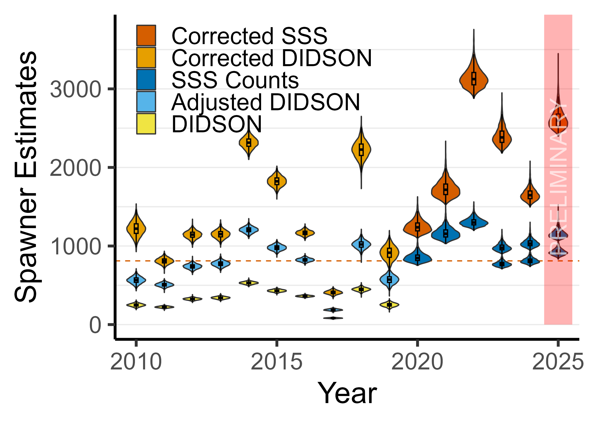

# Green Sturgeon Southern Distinct Population Segmant Spawner Survey Results

This repository contains outputs form the annual spawner survey of the southern distinct population segment of green sturgeon. There are 3 outputs: a graphs showing the estimates of spawners both corrected and uncorected, a data summaries for both corrected and uncorected estimates, and the Bayesian postieror date for estimates of spawners both corrected and uncorrected.

## Background:
The southern distinct population segment of green sturgeon (Acipenser medirostris) is threatened with extinction. This status is not uncommon for an anadromous fish as they face many threats, and especially for sturgeon which are one of the most critically endangered animal groups on the planet. The southern distinct population segment of green sturgeon (hereafter southern green sturgeon) is one of two distinct populations of green sturgeon. This population spawns in California’s Central Valley with the vast majority of spawning taking place in the Sacramento River. The primary causes for their decline is habitat loss and historical fishing. To protect southern green sturgeon from further decline, it is important to monitor their population abundance, as well as understand population characteristics that may allow people to more effectively conserve the species.

## Methods:
The study location was within the upper portion of the Sacramento River, California, USA. It extended from river kilometer 322 to 480 (just west of Chico, CA to Redding, CA)), as measured from the mouth of the Sacramento River (directly south of Collinsville, CA) (Fig. 1). Exposed bedrocks and some high cliffs which confine the channel characterize the section upstream or Red Bluff, CA. Downstream of Red Bluff, the Sacramento River is an alluvial stream which people have confined through bank revetments to protect agricultural fields.  Past observations indicate that green sturgeon spawn in a limited number of large, deep pools that are present throughout both sections. 

        Figure 1. Map showing the study site which covers the spawning area for the southern DPS of green sturgeon. The black outline is the state of California with the internal black line representing the Sacramento River up to Keswick Dam. In the zoom box, the red outline shows the area we surveyed. There are multiple spawning sites inside this area that shift location annually. The bottom (southern) end is the Irvine Finch Boat Ramp (near Chico, CA) and the top (northern) end is in Redding, CA. Background topographic map data copyrighted OpenStreetMap contributors and available from https://www.openstreetmap.org. Map projection WGS 84, coordinate system UTM zone 10N.

The survey typically takes place over four to five consecutive days in the month of May, June, or July. Over the sequential survey days, we scanned all potential green sturgeon spawning pools (> 5 m deep) within the spawning grounds, making three passes with a transom-mounted side-scan sonar (Humminbird brand) operating at 1.2 MHz. This unit can cover the extent of the spawning pools in a single pass, however, it has an 8° blind spot directly below the transducer. We conducted passes in a downstream direction at a speed between 7.4 to 14.8 km/h (4 to 8 knots) using a 6 m aluminum jet boat suitable for shallow rivers. If evidence of more than five fish existed, we conducted two additional passes to provide better statistical resolution. As sturgeon are known to congregate less frequently over boulder or bedrock substrate, and it would be difficult to differentiate them from the background with side-scan sonar, we only scanned these pools once to confirm a bolder or bedrock substrate (n = 3).  The images from each pass were stitched together using SonarTRX or later PingMapper to produce georeferenced images, from which we visually counted the sturgeon in QGIS. For each pool, this method resulted in repeated counts (one count per pass).

We used an n-mixture model in a Bayesian framework, which assumed the distribution of sturgeon among pools followed a negative-binomial distribution and their detectability per pass followed a beta distribution (Eq. 1) 

Eq. 1:

α~ normal(2,1)

β~ normal(2,1)

λ~ uniform(1,300)

δ~ uniform(0.1,20)

Β_δ=1/δ                              

Β_μ=Β_δ/((Β_δ+λ) )

N_i~nbinomial(Β_μ 〖,Β〗_δ )  

p_(i,j)~beta(α,β)  

n_(i,j)~binomial(p_(i,j),N_i )  
	

Here α and β are the two parameters for the beta distribution for the detectability per pass pi,j , λ and δ are parameters used in an alternative parametrization for the negative binomial distribution in jags, Bμ and Bδ (dispersion parameter) are the parameters for the negative binomial for the number of sturgeon in each pool Ni, and the number of sturgeon detected each pass ni,j is a binomial distribution with pi,j as the probability and Ni as the size.  

We ran three chains, with 5000 adaptation and burn in steps, and kept 1000 samples with a thinning of 250. We checked convergence graphically and checked performance with a graphical post predictive check. We also graphically ensured that the posterior distributions were not simply conforming to priors. To avoid a potentially flat solving surface and confounded parameters for some years, we used the time-for-space method where all the data across all years was analyzed in the same model with the same site in different years treated as different sites (e.g. site 10 in 2020 had a different Ni and a different set of ni,j’s and pi,j’s then site 10 in 2021).  

For two years (2020 and 2021) we were able to run the side-scan sonar and DIDSON system concurrently during the survey (the DIDSON broke and was unrepairable after 2021). From initial observations, we noted that the side-scan sonar’s wider field of view allowed it to observe more fish than the DIDSON. We checked the agreement between the DIDSON and side-scan sonar methods for those two years to see if there was a consistent ratio between the two methods that we could use to adjust the previous DIDSON counts.     

We then used telemetry data to estimate the fraction of the fish that entered the spawning grounds in that year and had already left or had not yet arrived within the spatial extent of our survey during the sampling event. We combined this value with our estimate of the number of observed sturgeon to get an estimate of total spawner abundance for that year. 

Unfortunately, the telemetry database is based on scientists voluntarily self-reporting tag data. Thus, the complete detection data are often several years behind, and doing a correction based on the current year’s (or recent past years’) tag data was not feasible at the time of analysis. In addition, several years had very low numbers of tagged fish detected in the river (as low as 9). These low numbers can result in large fluctuations in estimates if only a single fish enters or leaves the spawning grounds the week of the survey. Finally, previous unpublished work found little ability to predict the fraction of spawners still on the spawning grounds based on environmental covariates. Thus, we adopted a method to use the long-term average number of spawners present on the spawning grounds for each day of the year, rather than attempt to use a year-specific correction. To calculate this, we again used the same telemetry data, using only detections on the spawning ground (upstream of river kilometer 322) within the spawning window (March to October). We binned the detections in a window of four days (the time it takes to do a complete survey). We then assumed the first and last days that each tag was upstream of river kilometer 322 span the time window that the spawner was on the spawning ground. We divided the number of tagged fish in the system in each 4-day bin by the total number of tagged fish that entered the spawning grounds that season. We took the fraction of fish still on the spawning ground each day and averaged across each year, weighting by the total number of spawners detected that year. Based on the time of year we conducted the survey, we then divided the number we detected in our survey by the fraction present (Eq. 2) to estimate the total number of spawners each year. 

Eq. 2:

f_t=(∑_y [n_(t,y)/n_y * n_y/(∑_y n_y)])(1/N)	

Here ft is the fraction of total spawners on the spawning grounds on a given 4-day bin t, nt,y is the number of spawners on the spawning grounds on a given day t for a given year y, ny is the total numbers of spawners who entered the spawning grounds for a given year y, and N is the total number of spawners who entered the spawning ground over all years. 

## Summary Plot:

    Figure 2. Time series of spawner estimates. DIDSON counts are for the raw numbers counted using the DIDSON camera. Adjusted DIDSON are the DIDSON counts adjusted up using the data from the two years of overlap we had with the side-scan sonar. SSS Counts are the raw counts seen using the side-scan sonar.  Corrected SSS and Corrected DIDSON estimates are either the Adjusted DIDSON or SSS Counts numbers corrected using the telemetry data to account for missed spawners. The orange line is an approximate recovery goal.

## Key
### bayesian_posterior_census_counts.csv
year: the year of the census
run: the Bayesian sample (just samples taken during the Bayesian fitting)
census: the number of the census (some years have multiple censuses)
estimate: the estimate number of spawners
type: the type of estimate
    SSS Counts: Estimates based on sturgeon observed with side-scan sonar
    Corrected SSS: Estimates corrected for sturgeon missed using telemetry information
    DIDSON: Estimates based on sturgeon observed with DIDSON
    Adjusted DIDSON: Estimates adjusted for difference in detectability between side-scan sonar and DIDSON
    Corrected DIDSON: Estimates corrected for sturgeon missed using telemetry information

### summary_data_census_counts.csv
year: the year of the census
census: the number of the census (some years have multiple censuses)
type: the type of estimate
    SSS Counts: Estimates based on sturgeon observed with side-scan sonar
    Corrected SSS: Estimates corrected for sturgeon missed using telemetry information
    DIDSON: Estimates based on sturgeon observed with DIDSON
    Adjusted DIDSON: Estimates adjusted for difference in detectability between side-scan sonar and DIDSON
    Corrected DIDSON: Estimates corrected for sturgeon missed using telemetry information
mean: the mean across all Bayesian samples for that year and census
median: the median across all Bayesian samples for that year and census
sd: the standard deviation across all Bayesian samples for that year and census
hid_95_low: the lower bound of the 95% highest density interval across all Bayesian samples for that year and census
hid_95_high: the upper bound of the 95% highest density interval across all Bayesian samples for that year and census